**.Net Console Uygulamasının Dockerize Edilmesi**

- Öncelikle console uygulamamızı oluşturuyoruz.

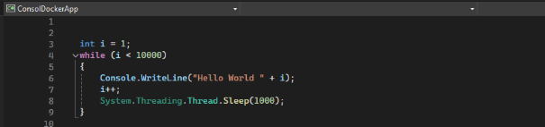

- Dockerfile dosyamızı projemize dahil ediyoruz.

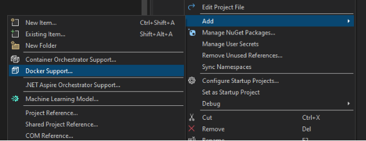

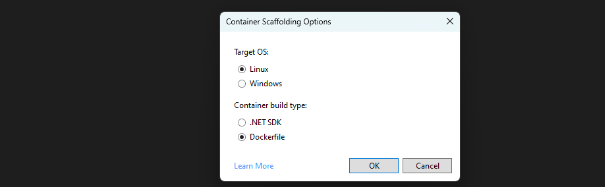

- Otomatik gelen “Dockerfile” dosyasında hazır kodlar mevcut.Ama basit console uygulaması için biz kendimiz yazdık.

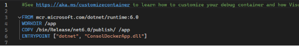

**Not :** Hazır image dosyasını (.net runtime image) Docker Hub’da bulabilirsin.Runtime projenin çalışabilmesini sağlayan araçları barındırırken sdk projenin geliştirilebilmesi için gereken koşullarıda sunar.Boyutu daha az ve performanslı olduğu için image dosyası olarak runtime kullanıyoruz.

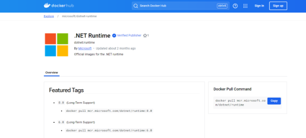

**Dockerfile Dosya Kodlarının Açıklaması**

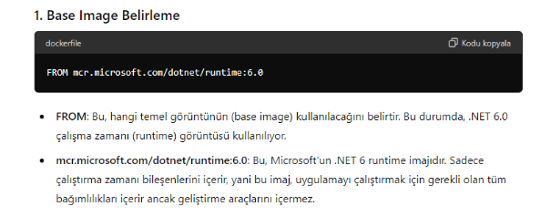

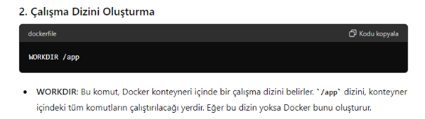

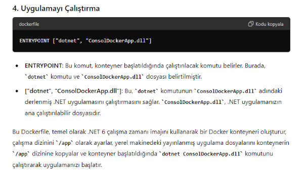

**Not :** Dockerfile dosyasındaki her değişiklikten sonra proje tekrar publish edilmelidir.

- Daha sonra *“ docker build -t <image name> . “*  komutu ile image oluşturulur.(Image adı küçük harflerden oluşmalıdır.)(Sondaki noktayı unutma.)

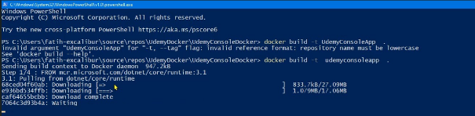

**Not :** *“ docker images “* komutu ile mevcut imageleri listeleyebilirsin.

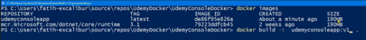

- Container oluşturmak için *“ docker create –name <container name> <kullanılacak image> ”*

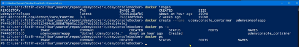

**Not :** *“ docker ps ”* komutu sadece çalışan containerları listeler.” docker ps -a ”* tüm containerları listeler. 

**Not :** Bu işlemler anında bilgisayarda Docer Desktop ayakta olmaldıır.Oluşan tüm image ve containerlar buradan da görülebilir.(Docker Desktop da giriş yapmalısın.)

**Not :** *“ docker start <container name> ”* ve *“ docker stop <container name> ”* komutları ile containerlar başlatılıp durdurulabilir.

**Not :** Container ayaktayken (çalışıyorken) arka tarafta programı çalıştırır.Herhangi bir anda çıktıyı gözlemlemek için consoledan *“ docker attach <container name> ”* veya Docker Desktop’dan log kısmından izlenebilir.

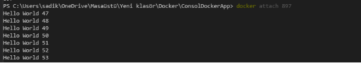

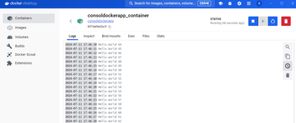
